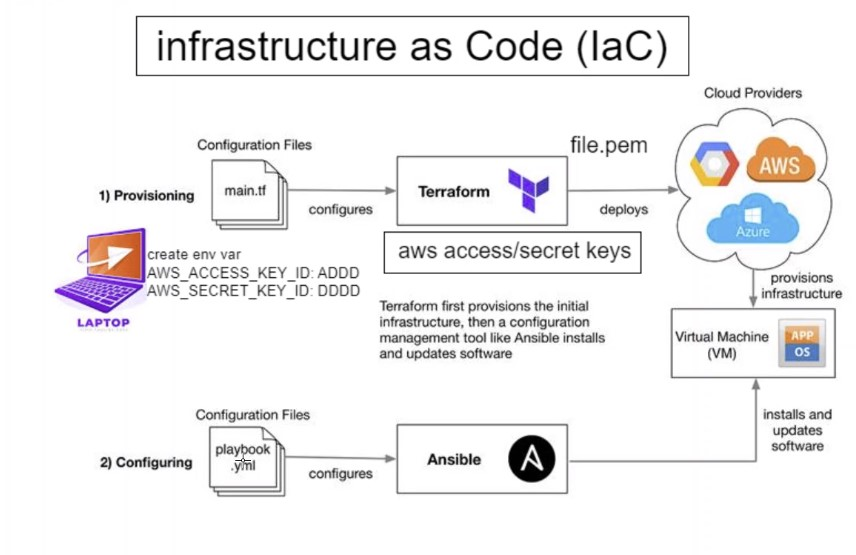

# Intro to IaC

Infrastructure as code (IaC) is the process of managing and provisioning computer data centers through machine-readable definition files, rather than physical hardware configuration or interactive configuration tools. Practicing infrastructure as code means applying the same rigor of application code development to infrastructure provisioning. All configurations should be defined in a declarative way and stored in a source control system such as AWS CodeCommit, the same as application code. Infrastructure provisioning, orchestration, and deployment should also support the use of the infrastructure as code.

---

### Infrastructure as Code Benefits:

**Speed:**
The first significant benefit IaC provides is speed. Infrastructure as code enables you to quickly set up your complete infrastructure by running a script. You can do that for every environment, from development to production, passing through staging, QA, and more. IaC can make the entire software development lifecycle more efficient.

**Consistency:**
Manual processes result in mistakes, period. Humans are fallible. Our memories fault us. Communication is hard, and we are in general pretty bad at it. As you’ve read, manual infrastructure management will result in discrepancies, no matter how hard you try. IaC solves that problem by having the config files themselves be the single source of truth. That way, you guarantee the same configurations will be deployed over and over, without discrepancies.

**Accountability:**
This one is quick and easy. Since you can version IaC configuration files like any source code file, you have full traceability of the changes each configuration suffered. No more guessing games about who did what and when.

**More Efficiency During the Whole Software Development Cycle:**
By employing infrastructure as code, you can deploy your infrastructure architectures in many stages. That makes the whole software development lif cycle more efficient, raising the team’s productivity to new levels.