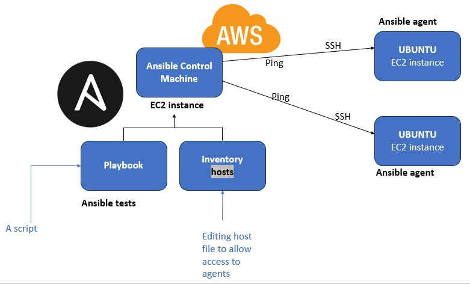

# Intro to Ansible

Ansible is a suite of software tools that enables infrastructure as code. It is open-source and the suite includes software provisioning, configuration management, and application deployment functionality.




Benefits of Ansible

Flexible: You can orchestrate the entire application environment no matter where it's deployed. You can also customize it based on your needs. 

Agentless: You don't need to install any other software or firewall ports on the client systems you want to automate.


---

1.	Update and upgrade on all machines to check internet connection
2.	Install ansible in the controller

```
sudo apt-get install software-properties-common
ansible --version
sudo apt install ansible
sudo apt-add-repository ppa:ansible/ansible
sudo apt update -y
sudo apt install anisible -y
```

3.	Check if hosts file is there

```
cd /etc/ansible/
ls
```

4.	Upload ssh pem file to the controller, change to chmod 400

```
cd ~/.ssh
sudo nano tech241.pem
sudo chmod 400 tech241.pem
```


5.	Check if ssh works to other machines

```
sudo ssh -i "tech241.pem" ubuntu@ec2-52-215-188-216.eu-west-1.compute.amazonaws.com

```

6.	cd /etc/ansible/ and nano hosts file to ping to the machines

```
cd /etc/ansible/
sudo nano hosts

```


7.	update upgrade to apply changes

```
sudo apt update -y
sudo apt upgrade -y

```


8.	sudo ansible web -m ping and expect pong

```
sudo ansible web -m ping

```


---

## Playbook
It's a file for YAML scripts


in /etc/ansible create .yml playbook file
run the file: 
```
sudo ansible-playbook nginx-playbook.yml
```


---

Playbook for app:

```
# why learn YAML - ansible uses YAML
# playbooks are re usable and can be used on all the nodes
# YAML file starts wirth --- three dashes
---

# which host to perform the task
- hosts: web

# see the logs by gathering facts
  gather_facts: yes

# admin (sudo) access
  become: true

# add the instructions - install nginx - web
  tasks:
  - name: Installing Nginx
    apt: pkg=nginx state=present

  tasks:
  - name: Installing NodeJS
    apt: pkg=nodejs state=present
    apt: pkg=npm state=present
    nmp start
# ensure the status of nginx is actively running

# adhoc command to check the status

```

---

Playbook for db:

```
---
# create a playbook to install mongodb in db machine/instance

# who will be host
- hosts: db


# get logs
  gather_facts: yes

# admin access
  become: true

# provide instructions - task
  tasks:


# install mongodb
  - name: Installing Mongodb
    apt: pkg=mongodb state=present

# ensure the db is running

# chech the status if it's running or not ashoc

  - name: Modify mongod.conf to change bindIp
    lineinfile:
      path: /etc/mongodb.conf
      regexp: '^bind_ip'
      line: 'bind_ip = 0.0.0.0'


  - name: Restart Mongodb
    service:
      name: mongodb
      state: restarted


  - name: Starting Mongodb
    service:
      name: mongodb
      state: started
      enabled: yes


```

