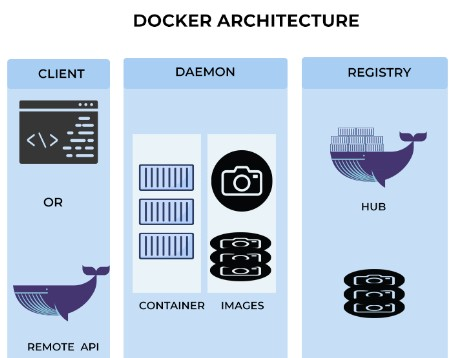

# Intro to Docker
Docker is a set of platform as a service products that use OS-level virtualization to deliver software in packages called containers. The service has both free and premium tiers. The software that hosts the containers is called Docker Engine.



---
### Installation

1. Install Docker for Windows [here](https://docs.docker.com/desktop/install/windows-install/)
2. Check the installation with ```docker --version```
3. Create a Docker account [here](https://login.docker.com/u/login/identifier?state=hKFo2SBkUWh0cTUxYVpsVEVhNFc4QWxPakhkMzNVOV9sN245c6Fur3VuaXZlcnNhbC1sb2dpbqN0aWTZIFhXa0UxU0RneTlKb3pjb08wWWcwSU5ueC1VajRkU09Xo2NpZNkgbHZlOUdHbDhKdFNVcm5lUTFFVnVDMGxiakhkaTluYjk)

### Huper-V on
1. Right click on the Windows button and select 'Apps and Features'.
2. Select Programs and Features on the right under related settings.
3. Select Turn Windows Features on or off.
4. Select Hyper-V and click OK.