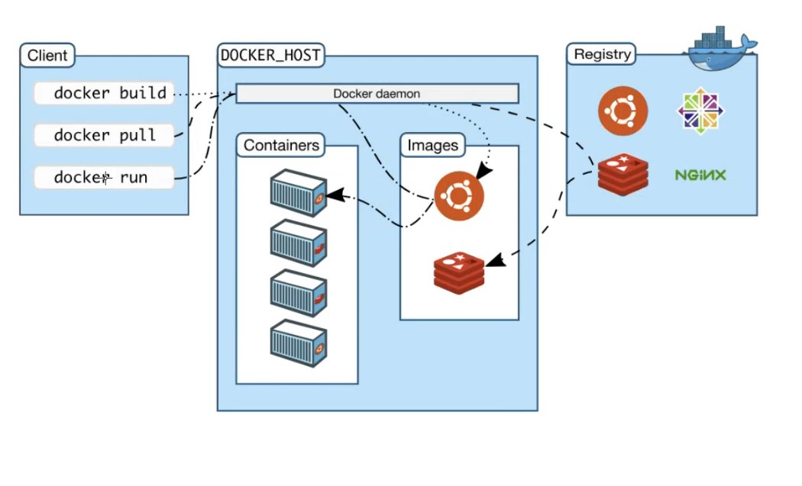

# Intro to Docker
Docker is a set of platform as a service products that use OS-level virtualization to deliver software in packages called containers. The service has both free and premium tiers. The software that hosts the containers is called Docker Engine.


---
### Installation

1. Install Docker for Windows [here](https://docs.docker.com/desktop/install/windows-install/)
2. Check the installation with ```docker --version```
3. Create a Docker account [here](https://login.docker.com/u/login/identifier?state=hKFo2SBkUWh0cTUxYVpsVEVhNFc4QWxPakhkMzNVOV9sN245c6Fur3VuaXZlcnNhbC1sb2dpbqN0aWTZIFhXa0UxU0RneTlKb3pjb08wWWcwSU5ueC1VajRkU09Xo2NpZNkgbHZlOUdHbDhKdFNVcm5lUTFFVnVDMGxiakhkaTluYjk)

### Huper-V on
1. Right click on the Windows button and select 'Apps and Features'.
2. Select Programs and Features on the right under related settings.
3. Select Turn Windows Features on or off.
4. Select Hyper-V and click OK.

### If you are not the administrator
Docker doesn't work if you are not the administrator of the PC, even if you run as administrator. To fix this, make the current user an administrator in ```Control Panel -> Change Account Type```. Additionally, run ```net localgroup docker-users "your-user-id" /ADD``` to add yourself to the user group. "your-user-id" is the account name for your machine.

---

### How does Docker API work?

The Engine API is an HTTP API served by Docker Engine. It is the API the Docker client uses to communicate with the Engine, so everything the Docker client can do can be done with the API. Most of the client's commands map directly to API endpoints (e.g. docker ps is GET /containers/json ).

---
### Checking the communication between the client, host and registry



Run ```docker run hello-world``` to test the connection.
Docker will take the following steps if the connection is there:
 1. The Docker client contacted the Docker daemon.
 2. The Docker daemon pulled the "hello-world" image from the Docker Hub.
    (amd64)
 3. The Docker daemon created a new container from that image which runs the
    executable that produces the output you are currently reading.
 4. The Docker daemon streamed that output to the Docker client, which sent it
    to your terminal.

Check the porcess status with ```docker ps -a```. Some AMIs you download are built so that it does a job and exits and doesn't keep running in the background. 

---
### Launching an EC2
1. ```docker run -d -p 80:80 nginx``` to run nginx on localhost port 80
2. ```docker ps``` to check docker process running
3. ```docker stop processID``` to stop the EC2
4. ```docker start sameProcessID``` to start the same EC2 again

---

### SSH into the image
1. ```docker exec -it processID sh``` execute in interactive mode using shell
2. ```apt update```
3. ```apt install sudo```
4. ```apt install nano```
5. to make some changes, find html file and edit it (in this case the path is: usr/share/nginx/html)
   

---
### Push the image to your Docker Hub

[Useful Docker documentation](https://docs.docker.com/get-started/04_sharing_app/)

1. Log-in to your Docker Hub
2. Create a repo
3. Log-in to your Docker Hub using ```docker login -u YOUR-USER-NAME``` command
4. Use ```docker tag nginx YOUR-USER-NAME/repo-name``` to edit the name of the image
5.  To **push** ```docker push YOUR-USER-NAME/repo-name``` 
6.  To **pull** ```docker pull tech241iveta/tech241-iveta-first-repo:latest```
7.  To **run** ```docker run -d -p 80:80 tech241iveta/tech241-iveta-first-repo:latest```


---
### Creating Dockerfile

1. Create index.html

```
<html>
<head>

<body>

<h1>This is Docker automation</h1>

</body>

</head>

</html>

```

2. In the same place, create Dockerfile

```
# select the base image
FROM nginx


# label it
LABEL MAINTAINER=iveta@sparta

# copy index.html froml localhost to default nginx index.html location
COPY index.html /usr/share/nginx/html/

# port mapping or exposing the required port
EXPOSE 80

# command to launch the web server
CMD ["nginx", "-g", "daemon off;"]

```

3. Build the image ```docker build -t tech241iveta/tech241-iveta-first-repo:latest .```
4. Run the image ```docker run -d -p 97:80 tech241iveta/tech241-iveta-first-repo:latest```