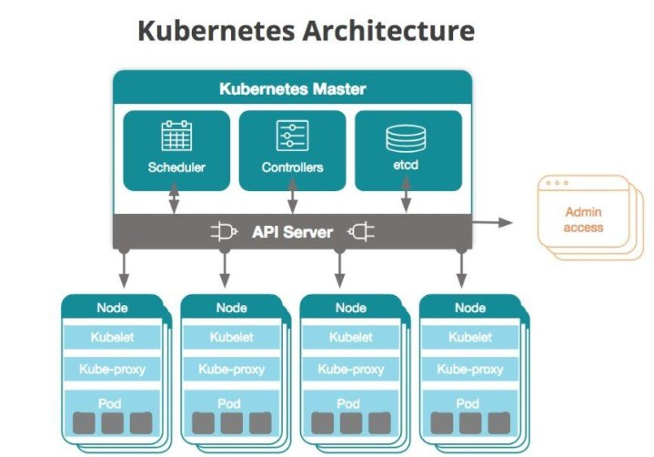
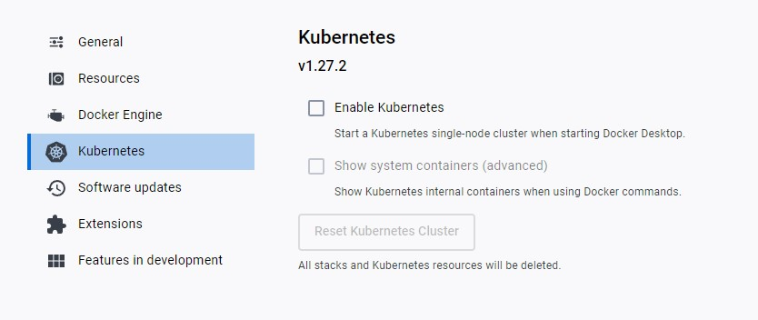

# Intro to Kubernetes

Kubernetes is an open-source container orchestration system for automating software deployment, scaling, and management. Originally designed by Google, the project is now maintained by the Cloud Native Computing Foundation. The name Kubernetes originates from Greek, meaning 'helmsman' or 'pilot'.

what is k8 (k8 objects (replica, cluster))


### Who is using it K8?

1. ‍Google‍ - Google has made over 900 thousand contributions to the Kubernetes project, far more than any other company, according to our Kubernetes Statistics. Google also offers the Google Container Engine (GKE) that allows organizations to run Kubernetes on the Google Cloud Platform.
2. Spotify‍ - after using Helios, its in-house container orchestration system for years, Spotify started migrating to Kubernetes in 2018 to take advantage of the growing community and robust feature set.
3. Capital One‍ - first shifted to Kubernetes to increase the resilience and speed of fraud detection and credit decision systems that worked on millions of daily transactions.
4. The New York Times‍ - runs GKE (Google Kuberneted Engine) on the Google Cloud Platform (GCP) primarily to increase deployment speed. Today, nearly all of The New York Times website’s user-facing applications run on GCP.
5. Pinterest‍ - after initially turning to Docker containers in early 2017, Pinterest engineers decided to use Kubernetes for orchestration to manage efficiencies in a decentralized way.
6. Adidas‍ - a mix of Kubernetes running on AWS and Prometheus cut the Adidas website load time in half and allowed the team to release improvements 10,000% faster—from once every 4-6 weeks to 3-4 times per day.
7. Tinder‍ - today, the Tinder Platform operates completely on Kubernetes which can handle all of the individual microservices that Tinder uses. Tinder’s containers can now serve traffic in a matter of seconds instead of minutes.
8. Airbnb - uses Kubernetes to run the hundreds of services they use to operate on a unified and scalable infrastructure including multiple clusters and thousands of nodes.

---
### Key benefits
1. Container orchestration savings

Kubernetes automatically provisions and fits containers into nodes for the best use of resources. Some public cloud platforms charge a management fee for every cluster, so running fewer clusters means fewer API servers and other redundancies and helps lower costs.


2. Increased DevOps efficiency for microservices architecture

Container integration and access to storage resources with different cloud providers make development, testing and deployment simpler. Creating container images — which contain everything an application needs to run — is easier and more efficient than creating virtual machine (VM) images. All this means faster development and optimized release and deployment times.

3. Deploying workloads in multicloud environments
4. More portability with less chance of vendor lock-in

Using containers for your applications provides a lightweight, more agile way to handle virtualization than with virtual machines (VMs). Because containers only contain the resources an application actually needs (i.e., its code, installations and dependencies) and use the features and resources of the host operating system (OS), they are smaller, faster and more portable. For instance, hosting four apps on four virtual machines would generally require four copies of a guest OS to run on that server. Running those four apps in a container approach, though, means containing all of them within a single container where they share one version of the host OS.


5. Automation of deployment and scalability

Kubernetes schedules and automates container deployment across multiple compute nodes, whether on the public cloud, onsite VMs or physical on-premises machines. Its automatic scaling lets teams scale up or down to meet demand faster.

6. App stability and availability in a cloud environment

 If one node in a multi-node cluster fails, the workload is redistributed to others without disrupting availability to users. It also provides self-healing capabilities and will restart, reschedule or replace a container when it fails or when nodes die. 

7. Open-source 

---

### What makes up a Kubernetes cluster?

A Kubernetes cluster is a set of nodes that run containerized applications. Containerizing applications packages an app with its dependences and some necessary services. They are more lightweight and flexible than virtual machines. In this way, Kubernetes clusters allow for applications to be more easily developed, moved and managed.

 


A Kubernetes cluster contains six main components: 

1. API server: Exposes a REST interface to all Kubernetes resources. Serves as the front end of the Kubernetes control plane. 

2. Scheduler: Places containers according to resource requirements and metrics. Makes note of Pods with no assigned node, and selects nodes for them to run on. 

3. Controller manager: Runs controller processes and reconciles the cluster’s actual state with its desired specifications. Manages controllers such as node controllers, endpoints controllers and replication controllers. 

4. Kubelet: Ensures that containers are running in a Pod by interacting with the Docker engine , the default program for creating and managing containers. Takes a set of provided PodSpecs and ensures that their corresponding containers are fully operational. 

5. Kube-proxy: Manages network connectivity and maintains network rules across nodes. Implements the Kubernetes Service concept across every node in a given cluster. 

6. Etcd: Stores all cluster data. Consistent and highly available Kubernetes backing store.  

These six components can each run on Linux or as Docker containers. The master node runs the API server, scheduler and controller manager, and the worker nodes run the kubelet and kube-proxy. 


---

### Objects in Kubernetes

Kubernetes objects are persistent entities in the Kubernetes system. Kubernetes uses these entities to represent the state of your cluster. Specifically, they can describe:

- What containerized applications are running (and on which nodes)
- The resources available to those applications
- The policies around how those applications behave, such as restart policies, upgrades, and fault-tolerance

A Kubernetes object is a "record of intent"--once you create the object, the Kubernetes system will constantly work to ensure that object exists. By creating an object, you're effectively telling the Kubernetes system what you want your cluster's workload to look like; this is your cluster's desired state.

To work with Kubernetes objects--whether to create, modify, or delete them--you'll need to use the Kubernetes API. When you use the kubectl command-line interface, for example, the CLI makes the necessary Kubernetes API calls for you. You can also use the Kubernetes API directly in your own programs using one of the Client Libraries.

Object spec and status


---


### Connecting

Use ```kubectl get service``` to check the connection. If no connection can be made:
1. Check if ports are available
2. Restart cluster
3. Check that Kubernetes is available on Docker Desktop ```Settings -> Kubernetes```

