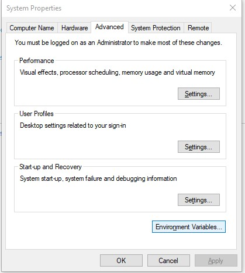
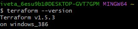
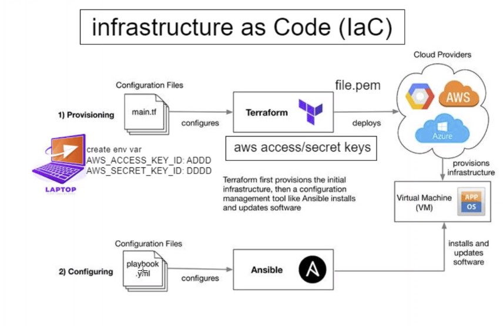
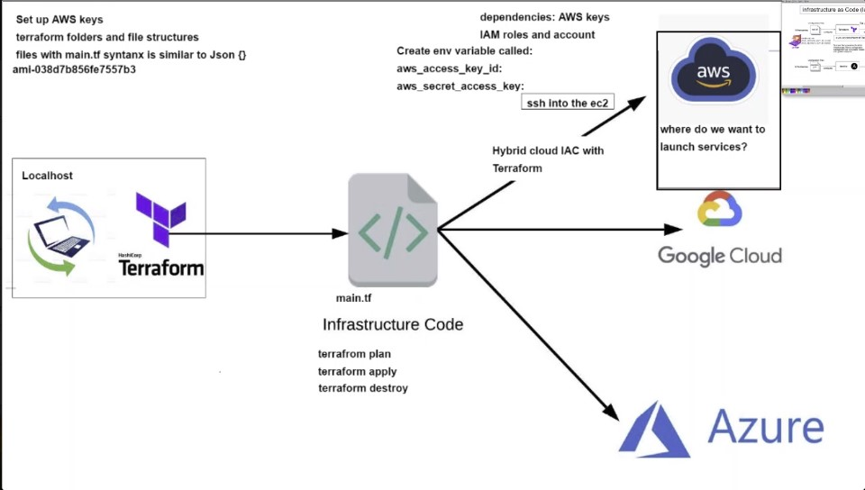

# Intro to Terraform

Terraform is an open-source infrastructure-as-code software tool created by HashiCorp. Users define and provide data center infrastructure using a declarative configuration language known as HashiCorp Configuration Language, or optionally JSON.

---

### Why Terraform?

**Improved collaboration:**
   
It allows teams to define and manage infrastructure using version control, which makes it easier for multiple people to collaborate and work on the same codebase. This can help improve collaboration and reduce the risk of errors.

**Version history:**
   
It automatically maintains a version history of your infrastructure, which makes it easy to roll back to previous versions if necessary. This can help protect against mistakes and ensure that you can recover from failures quickly.

**Consistency:**
   
It allows you to define your infrastructure using a high-level configuration language, which means that you can specify the desired state of your infrastructure in a consistent and predictable way.

**Reusability:**
   
It allows you to define infrastructure as modular components, which can be easily reused across multiple deployments. This can help reduce duplication and make it easier to manage your infrastructure at scale.

**Portable across cloud providers:**
   
It is portable across different cloud providers, which means that you can use the same tools and processes to manage your infrastructure regardless of where it is deployed.

---

### Who uses Terraform?

Around the world in 2023, over 27781 have started using Terraform as Configuration Management tool.

Some customers of Terraform include:
- Mercedes - Benz AG
- Samsung Electronics Co
- Booking.com
- Adobe, Inc.
---

### Installation on Windows

1. Install a package provided on Terraform website ([here](https://developer.hashicorp.com/terraform/downloads))
2. Create Path environmental variable on your machine. Add the path to your installed package. 
    ```Control Panel``` -> ```System``` -> ```System settings``` -> ```Environment Variables```



1. Run ```terraform --version``` on your machine to test the installation




---

### Implementing Terraform and AWS





1. Using access and scret keys as we're not SSH into the VMs, but rather acessing AWS. Add these keys in ```Environment Variables``` as  ***aws_access_key_id*** and ***aws_secret_access_key***
2. Create main.tf script (script below)
3. ```terraform init```
4. ```terraform plan```
5. ```terraform apply```
6. ```terraform destroy```


### main.tf for creating ec2:

```terraform
# launch an ec2 instance
# which cloud - aws
# terraform downloads required dependancies
# terraform init

# provider name
provider "aws"{
        # which part of this AWS
        region = "eu-west-1"

}

# Launch an ec2 in Ireland
resource "aws_instance" "app_instance"{

# which machine/OS version etc. AMI-id
  ami = "ami-0943382e114f188e8"

# what type of instance (micro)
  instance_type = "t2.micro"

# is the public IP required
  associate_public_ip_address = true

# what would you like to name it (iveta-tech241-terraforn-app)
  tags = {
       Name = "tech241-iveta-terraform-app"
  }

}


```


### main.tf to create VPC and EC2 in the VPC subnets:

```
# provider name
provider "aws"{
        # which part of this AWS
        region = "eu-west-1"

}

# Launch an ec2 in Ireland
resource "aws_instance" "app_instance"{

# which machine/OS version etc. AMI-id
  ami = "ami-0c0a51700"

# what type of instance (micro)
  instance_type = "t2.micro"

# is the public IP required
  associate_public_ip_address = true

  subnet_id = aws_subnet.app-public-subnet.id

# what would you like to name it (iveta-tech241-terraforn-app)
  tags = {
       Name = "tech241-iveta-terraform-app"
  }

}


# create VPC
resource "aws_vpc" "two-tier-VPC" {
  cidr_block       = "10.0.0.0/16"
  instance_tenancy = "default"

  tags = {
    Name = "tech241-iveta-vpc-terraform"
  }
}


# Create internet gateway
resource "aws_internet_gateway" "igw" {
  vpc_id = aws_vpc.two-tier-VPC.id

  tags = {
    Name = "2-tier-igwa-terraform"
  }
}


# create route
resource "aws_route" "route_igw" {
  route_table_id            = aws_vpc.two-tier-VPC.main_route_table_id
  destination_cidr_block    = "0.0.0.0/0"
  gateway_id                = aws_internet_gateway.igw.id
}


# create subnet
resource "aws_subnet" "app-public-subnet" {
  vpc_id     = aws_vpc.two-tier-VPC.id
  cidr_block = "10.0.2.0/24"
  availability_zone = ""

  tags = {
    Name = "public-app-subnet"
  }
}


```